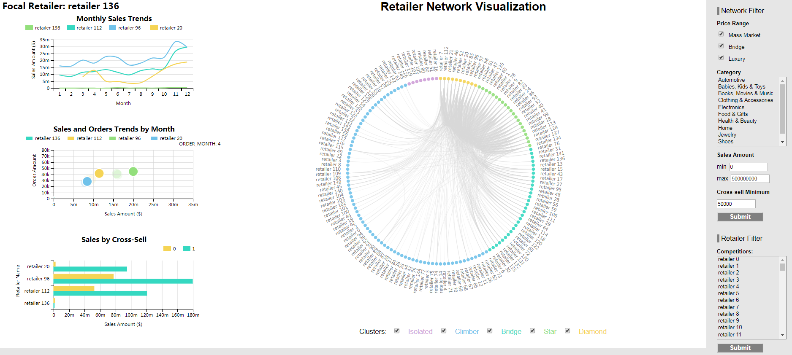

## Overview
This is a demonstration of a retailer network segmentation project that we worked on between January 2018 and June 2018 for Chicago-based e-commerce company ShopRunner [[link](https://www.shoprunner.com/home)]. We analyzed customer orders data and produced valuable insights and tools for our client. The final product of the original project included several presentations, analysis reports and a web-based interactive dashboard. We re-created the main part of this project with fully randomized data and this repository will show you the process.

 
 
**A snapshot of our dashboard!** 

 
 

## Team Members
* Xiaowei Li [[GitHub](https://github.com/weiweiweiweili)]
* Junxiong Liu [[GitHub](https://github.com/junxiongliu)]
* Hao Xiao [[GitHub](https://github.com/HaoXiao2018)]
* Wenjing Yang [[GitHub](https://github.com/wyo9057)]
* Tong Yin [[GitHub](https://github.com/Tong-Yin)]

## Important Files
* `data` folder aims to contain all the data. We re-created the raw data by changing important sensitive features via randomization, masking, or renaming. The data can be downloaded from here [[Link](...)]
	* `generated` subfolder aims to contain all data generated by files in `scripts\data_creation`. 
	* `raw` subfolder aims to contain raw orders data we re-created for this project. Note that you will only get a sample of this raw data from the download folder. Please contact us if you look for the full raw data.
* `scripts` folder contains all scripts that we used in this project.
	* `analysis` subfolder contains scripts to analyze the data.
	* `data_creation` subfolder contains scripts to create the data from raw.
	* `viz` subfolder contains the files to run the visualization.

## Details
* Data creation/generation: 
	 TO BE FILLED...
* Data Analysis: 
	`scripts/analysis/analysis.Rmd` file includes a simplified version of our original analysis. The main objective is to segment retailers in the network in order to inform strategies such as cross-sell. In this analysis, we used various machine learning techniques including unsupervised methods (PCA, Clusterings) as well as supervised approaches (Trees, Regressions).
* Data Visualization: 
	 TO BE FILLED...